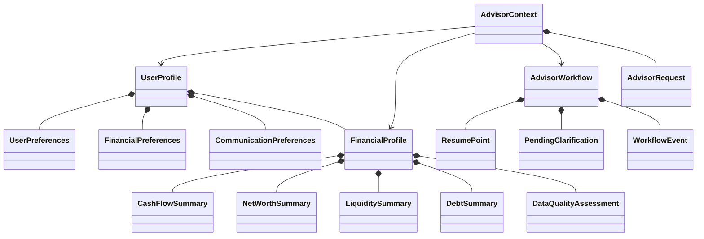

# Core Data Objects

## Purpose

The Core Data Objects specification defines the implementation-ready structure of the Financial Friday Advisor's primary domain objects.

The Domain Model defines the meaning and relationships of the Advisor's business concepts.

This document defines the concrete data required to represent those concepts consistently across:

- application services
- engine interfaces
- persistence
- APIs
- workflow state
- testing
- audit records

Each object specification includes:

- purpose
- ownership
- fields
- required and optional properties
- validation rules
- relationships
- lifecycle considerations
- persistence considerations
- extension points

The object definitions in this document are technology-independent.

They may later be implemented as:

- Dart models
- JSON schemas
- database records
- API contracts
- event payloads
- test fixtures

without changing their business meaning.

---

# Guiding Principle

Every stored field should have a clear business purpose.

A field should not exist merely because it may be convenient to store.

Core Data Objects should contain the minimum information necessary to preserve:

- meaning
- consistency
- traceability
- explainability
- future compatibility

---

# Object Specification Conventions

Each object definition uses the following conventions.

| Convention | Meaning                                          |
| ---------- | ------------------------------------------------ |
| Required   | The field must exist for the object to be valid  |
| Optional   | The field may be absent or null                  |
| Derived    | The field is calculated from other data          |
| Immutable  | The field should not change after creation       |
| Mutable    | The field may change during the object lifecycle |
| Reference  | The field points to another object by identifier |
| Embedded   | The field is stored within the owning object     |
| Sensitive  | The field requires elevated privacy protection   |

---

# Common Field Standards

Unless otherwise specified, aggregate roots should include the following standard fields.

| Field         | Type               | Requirement | Description                                   |
| ------------- | ------------------ | ----------: | --------------------------------------------- |
| id            | Identifier         |    Required | Stable unique identifier                      |
| schemaVersion | String             |    Required | Version of the object schema                  |
| createdAt     | Timestamp          |    Required | Time the object was created                   |
| updatedAt     | Timestamp          |    Required | Time the object was last changed              |
| createdBy     | ActorReference     |    Optional | Actor or service that created the object      |
| updatedBy     | ActorReference     |    Optional | Actor or service that last changed the object |
| metadata      | Map<String, Value> |    Optional | Non-domain extension metadata                 |

Identifiers should remain stable throughout the object's lifecycle.

Timestamps should use Coordinated Universal Time.

Schema versions should be explicit and machine-readable.

---

# Foundational Objects

The foundational objects define the minimum data required to represent:

- the user
- the user's financial position
- an active Advisor request
- the workflow processing that request

This section specifies:

- AdvisorContext
- AdvisorWorkflow
- UserProfile
- FinancialProfile

---

# AdvisorContext

## Purpose

AdvisorContext represents the complete working context used by the Advisor during one reasoning workflow.

It combines persistent user data, current request information, retrieved intelligence, workflow references, and temporary reasoning inputs into a single execution model.

AdvisorContext is the primary input to the Advisor Engine.

---

## Ownership

AdvisorContext is an aggregate root for temporary reasoning state.

It owns workflow-specific context.

It references persistent user objects rather than embedding authoritative copies of them.

---

## Object Definition

```text
AdvisorContext
```

| Field                    | Type                     | Requirement | Description                               |
| ------------------------ | ------------------------ | ----------: | ----------------------------------------- |
| id                       | AdvisorContextId         |    Required | Stable context identifier                 |
| schemaVersion            | String                   |    Required | Schema version                            |
| workflowId               | AdvisorWorkflowId        |    Required | Associated workflow                       |
| userProfileId            | UserProfileId            |    Required | User receiving advice                     |
| financialProfileId       | FinancialProfileId       |    Required | Financial profile snapshot used           |
| request                  | AdvisorRequest           |    Required | Current user request                      |
| operatingMode            | OperatingModeSnapshot    |    Required | Active reasoning mode                     |
| goalIds                  | List<GoalId>             |    Optional | Goals relevant to the request             |
| riskIds                  | List<RiskId>             |    Optional | Risks identified during reasoning         |
| opportunityIds           | List<OpportunityId>      |    Optional | Opportunities identified during reasoning |
| memoryReferences         | List<MemoryReference>    |    Optional | Retrieved long-term memories              |
| behaviorProfileReference | BehaviorProfileReference |    Optional | Behavioral profile used                   |
| financialStoryReference  | FinancialStoryReference  |    Optional | Financial story used                      |
| assumptions              | List<Assumption>         |    Optional | Explicit working assumptions              |
| unknowns                 | List<UnknownValue>       |    Optional | Missing information known to be relevant  |
| constraints              | List<AdvisorConstraint>  |    Optional | User, policy, or system constraints       |
| contextSnapshotAt        | Timestamp                |    Required | Time the context was assembled            |
| dataFreshness            | DataFreshnessSummary     |    Required | Freshness summary for referenced data     |
| pipelineState            | PipelineStateSnapshot    |    Optional | Current pipeline execution state          |
| createdAt                | Timestamp                |    Required | Context creation time                     |
| updatedAt                | Timestamp                |    Required | Last context update                       |
| expiresAt                | Timestamp                |    Optional | Time temporary context may expire         |
| metadata                 | Map<String, Value>       |    Optional | Extension metadata                        |

---

## AdvisorRequest

AdvisorRequest represents the user input that initiated or resumed the workflow.

| Field                    | Type                      | Requirement | Description                   |
| ------------------------ | ------------------------- | ----------: | ----------------------------- |
| id                       | AdvisorRequestId          |    Required | Request identifier            |
| originalText             | String                    |    Required | Original user request         |
| normalizedIntent         | String                    |    Optional | Normalized request intent     |
| requestType              | AdvisorRequestType        |    Required | Category of request           |
| submittedAt              | Timestamp                 |    Required | Request submission time       |
| source                   | RequestSource             |    Required | Channel or application source |
| parentRequestId          | AdvisorRequestId          |    Optional | Prior request being continued |
| clarificationResponseTo  | ClarificationId           |    Optional | Clarification being answered  |
| locale                   | LocaleCode                |    Optional | User locale for this request  |
| timezone                 | TimezoneId                |    Optional | User timezone                 |
| attachments              | List<AttachmentReference> |    Optional | Referenced files or images    |
| userSpecifiedConstraints | List<AdvisorConstraint>   |    Optional | Explicit request restrictions |

---

## Validation Rules

An AdvisorContext is valid only when:

- `workflowId` references an existing AdvisorWorkflow.
- `userProfileId` references an existing UserProfile.
- `financialProfileId` references a valid FinancialProfile or preserved snapshot.
- `request.originalText` is not empty.
- `operatingMode` is present.
- `contextSnapshotAt` is not earlier than the request submission time.
- every referenced Goal belongs to the same user.
- every referenced Risk and Opportunity belongs to the same workflow context.
- expired data is explicitly identified in `dataFreshness`.
- assumptions are distinguishable from verified facts.

---

## Mutation Rules

AdvisorContext may be updated when:

- clarification is received
- new financial data is retrieved
- the operating mode changes
- additional risks or opportunities are identified
- assumptions are resolved
- missing information becomes available
- the workflow resumes

Changes should preserve prior context versions when auditability is required.

---

## Persistence Considerations

AdvisorContext should normally be stored as temporary workflow state.

Long-term retention may be appropriate for:

- audit records
- debugging
- recommendation reconstruction
- regulated environments
- quality evaluation

Persistent storage should avoid duplicating sensitive financial data when stable references are sufficient.

---

## Extension Points

Future versions may add:

- scenario references
- simulation inputs
- household context
- advisor persona
- regulatory jurisdiction
- professional advisor collaboration
- institutional account context

---

# AdvisorWorkflow

## Purpose

AdvisorWorkflow represents the stateful lifecycle of one Advisor reasoning session.

It coordinates processing across initial request intake, clarification, resume, recommendation generation, and completion.

The Workflow State Model defines its behavior.

This document defines its stored data.

---

## Ownership

AdvisorWorkflow is an aggregate root.

It owns:

- status
- stage progression
- clarification state
- resume state
- workflow events
- workflow output references

It does not own persistent user financial data.

---

## Object Definition

```text
AdvisorWorkflow
```

| Field                   | Type                    | Requirement | Description                         |
| ----------------------- | ----------------------- | ----------: | ----------------------------------- |
| id                      | AdvisorWorkflowId       |    Required | Stable workflow identifier          |
| schemaVersion           | String                  |    Required | Schema version                      |
| userProfileId           | UserProfileId           |    Required | User associated with workflow       |
| advisorContextId        | AdvisorContextId        |    Optional | Current active context              |
| status                  | WorkflowStatus          |    Required | Current workflow status             |
| currentStage            | PipelineStage           |    Required | Current pipeline stage              |
| resumePoint             | ResumePoint             |    Optional | Stage and state used for resumption |
| initialRequestId        | AdvisorRequestId        |    Required | Request that created the workflow   |
| latestRequestId         | AdvisorRequestId        |    Required | Most recent request                 |
| recommendationPackageId | RecommendationPackageId |    Optional | Final or current output             |
| pendingClarification    | PendingClarification    |    Optional | Clarification awaiting user input   |
| workflowEvents          | List<WorkflowEvent>     |    Required | Ordered workflow event history      |
| failureState            | WorkflowFailure         |    Optional | Current or most recent failure      |
| attemptCount            | Integer                 |    Required | Number of processing attempts       |
| maxAttempts             | Integer                 |    Optional | Retry limit                         |
| idempotencyKey          | String                  |    Optional | Duplicate execution protection      |
| startedAt               | Timestamp               |    Required | Workflow start time                 |
| lastActivityAt          | Timestamp               |    Required | Most recent activity                |
| pausedAt                | Timestamp               |    Optional | Time workflow entered paused state  |
| resumedAt               | Timestamp               |    Optional | Most recent resume time             |
| completedAt             | Timestamp               |    Optional | Completion time                     |
| failedAt                | Timestamp               |    Optional | Failure time                        |
| cancelledAt             | Timestamp               |    Optional | Cancellation time                   |
| expiresAt               | Timestamp               |    Optional | Workflow expiration time            |
| createdAt               | Timestamp               |    Required | Record creation time                |
| updatedAt               | Timestamp               |    Required | Record update time                  |
| metadata                | Map<String, Value>      |    Optional | Extension metadata                  |

---

## Workflow Status

Recommended workflow statuses include:

```text
created
running
waiting_for_clarification
paused
resuming
completed
failed
cancelled
expired
archived
```

Only one status may be active at a time.

---

## ResumePoint

ResumePoint preserves the minimum state necessary to continue processing.

| Field           | Type                        | Requirement | Description                         |
| --------------- | --------------------------- | ----------: | ----------------------------------- |
| stage           | PipelineStage               |    Required | Stage from which processing resumes |
| checkpointId    | String                      |    Required | Stable checkpoint identifier        |
| contextVersion  | String                      |    Required | Context version at pause time       |
| requiredInputs  | List<RequiredInput>         |    Optional | Inputs required before resumption   |
| completedStages | List<PipelineStage>         |    Optional | Stages already completed            |
| engineOutputs   | List<EngineOutputReference> |    Optional | Reusable outputs from prior stages  |
| createdAt       | Timestamp                   |    Required | Resume point creation time          |

---

## PendingClarification

PendingClarification represents an unresolved question that prevents reliable continuation.

| Field                   | Type                | Requirement | Description                        |
| ----------------------- | ------------------- | ----------: | ---------------------------------- |
| id                      | ClarificationId     |    Required | Clarification identifier           |
| question                | String              |    Required | User-facing clarification question |
| reason                  | String              |    Required | Why the information is needed      |
| requestedFields         | List<String>        |    Optional | Missing fields being requested     |
| acceptableResponseTypes | List<ValueType>     |    Optional | Accepted answer formats            |
| blocking                | Boolean             |    Required | Whether processing must stop       |
| requestedAt             | Timestamp           |    Required | Time clarification was requested   |
| expiresAt               | Timestamp           |    Optional | Clarification expiration           |
| responseRequestId       | AdvisorRequestId    |    Optional | Request containing the answer      |
| resolvedAt              | Timestamp           |    Optional | Resolution time                    |
| resolutionStatus        | ClarificationStatus |    Required | Current resolution state           |

---

## WorkflowEvent

WorkflowEvent represents an auditable change in workflow state.

| Field         | Type               | Requirement | Description                             |
| ------------- | ------------------ | ----------: | --------------------------------------- |
| id            | WorkflowEventId    |    Required | Event identifier                        |
| eventType     | WorkflowEventType  |    Required | Type of event                           |
| workflowId    | AdvisorWorkflowId  |    Required | Owning workflow                         |
| stage         | PipelineStage      |    Optional | Related pipeline stage                  |
| occurredAt    | Timestamp          |    Required | Event time                              |
| actor         | ActorReference     |    Optional | Actor responsible                       |
| message       | String             |    Optional | Human-readable description              |
| payload       | Map<String, Value> |    Optional | Event-specific data                     |
| correlationId | String             |    Optional | Cross-service correlation identifier    |
| causationId   | String             |    Optional | Event or command that caused this event |

Workflow events should be append-only whenever practical.

---

## Validation Rules

An AdvisorWorkflow is valid only when:

- `userProfileId` is present.
- `initialRequestId` is present.
- `latestRequestId` is present.
- `status` and timestamp fields are internally consistent.
- a completed workflow has `completedAt`.
- a failed workflow has `failureState` and `failedAt`.
- a cancelled workflow has `cancelledAt`.
- a workflow waiting for clarification has `pendingClarification`.
- `attemptCount` is zero or greater.
- workflow events are ordered chronologically.
- `recommendationPackageId` belongs to the same workflow.
- only one unresolved blocking clarification exists unless parallel clarification is explicitly supported.

---

## State Transition Rules

Valid transitions should include:

```text
created -> running

running -> waiting_for_clarification
running -> paused
running -> completed
running -> failed
running -> cancelled

waiting_for_clarification -> resuming
waiting_for_clarification -> expired
waiting_for_clarification -> cancelled

paused -> resuming
paused -> cancelled
paused -> expired

resuming -> running
resuming -> failed

failed -> resuming
failed -> archived

completed -> archived
cancelled -> archived
expired -> archived
```

Invalid transitions should be rejected by the domain layer.

---

## Persistence Considerations

AdvisorWorkflow should be persisted whenever resumability is supported.

Recommended persistence behavior:

- save after every stage transition
- save before requesting clarification
- save after receiving clarification
- save before invoking non-idempotent external services
- save after producing the RecommendationPackage
- append workflow events independently when possible

Workflow state should support optimistic concurrency control.

---

## Extension Points

Future versions may add:

- parallel stage execution
- multi-user workflows
- human advisor review
- approval checkpoints
- workflow branching
- sub-workflows
- scheduled continuation
- external event triggers

---

# UserProfile

## Purpose

UserProfile represents the persistent identity, preferences, and long-term configuration of a Financial Friday user.

It contains information that remains useful across multiple workflows.

---

## Ownership

UserProfile is an aggregate root.

It owns:

- personalization settings
- financial preferences
- communication preferences
- household references
- active financial profile reference
- behavioral and story references
- goal references

---

## Object Definition

```text
UserProfile
```

| Field                    | Type                            | Requirement | Description                                |
| ------------------------ | ------------------------------- | ----------: | ------------------------------------------ |
| id                       | UserProfileId                   |    Required | Stable user identifier                     |
| schemaVersion            | String                          |    Required | Schema version                             |
| externalIdentityIds      | List<ExternalIdentityReference> |    Optional | Authentication or platform identities      |
| displayName              | String                          |    Optional | Preferred display name                     |
| legalName                | PersonName                      |    Optional | Legal name when required                   |
| dateOfBirth              | LocalDate                       |    Optional | Birth date                                 |
| householdId              | HouseholdId                     |    Optional | Associated household                       |
| activeFinancialProfileId | FinancialProfileId              |    Required | Current authoritative financial profile    |
| behaviorProfileId        | BehaviorProfileId               |    Optional | Current behavioral profile                 |
| financialStoryId         | FinancialStoryId                |    Optional | Current financial story                    |
| goalIds                  | List<GoalId>                    |    Optional | User-owned goals                           |
| preferences              | UserPreferences                 |    Required | Personalization preferences                |
| financialPreferences     | FinancialPreferences            |    Optional | Financial decision preferences             |
| communicationPreferences | CommunicationPreferences        |    Optional | Communication settings                     |
| riskTolerance            | RiskToleranceProfile            |    Optional | User risk tolerance                        |
| jurisdiction             | JurisdictionReference           |    Optional | Applicable legal or financial jurisdiction |
| onboardingStatus         | OnboardingStatus                |    Required | Onboarding lifecycle state                 |
| profileCompleteness      | ProfileCompleteness             |     Derived | Summary of available profile data          |
| consentRecords           | List<ConsentRecord>             |    Optional | User consent history                       |
| status                   | UserProfileStatus               |    Required | Current profile status                     |
| createdAt                | Timestamp                       |    Required | Profile creation time                      |
| updatedAt                | Timestamp                       |    Required | Last profile update                        |
| lastActiveAt             | Timestamp                       |    Optional | Most recent user activity                  |
| archivedAt               | Timestamp                       |    Optional | Archive time                               |
| metadata                 | Map<String, Value>              |    Optional | Extension metadata                         |

---

## UserPreferences

| Field                 | Type                  | Requirement | Description                            |
| --------------------- | --------------------- | ----------: | -------------------------------------- |
| locale                | LocaleCode            |    Required | Preferred locale                       |
| currency              | CurrencyCode          |    Required | Preferred currency                     |
| timezone              | TimezoneId            |    Required | Preferred timezone                     |
| explanationDepth      | ExplanationDepth      |    Required | Preferred response detail              |
| tonePreference        | CommunicationTone     |    Optional | Preferred communication style          |
| advisorProactivity    | ProactivityLevel      |    Optional | Desired proactive behavior             |
| defaultOperatingMode  | OperatingModeType     |    Optional | Preferred default mode                 |
| showConfidence        | Boolean               |    Optional | Whether confidence should be visible   |
| showAssumptions       | Boolean               |    Optional | Whether assumptions should be surfaced |
| accessibilitySettings | AccessibilitySettings |    Optional | Accessibility preferences              |

---

## FinancialPreferences

| Field                     | Type                       | Requirement | Description                           |
| ------------------------- | -------------------------- | ----------: | ------------------------------------- |
| planningHorizon           | PlanningHorizon            |    Optional | Preferred planning timeframe          |
| liquidityPreference       | LiquidityPreference        |    Optional | Preference for accessible cash        |
| debtStrategyPreference    | DebtStrategyType           |    Optional | Preferred debt repayment style        |
| investmentStyle           | InvestmentStyle            |    Optional | Preferred investment approach         |
| emergencyFundTargetMonths | Decimal                    |    Optional | Desired months of expenses in reserve |
| savingsRateTarget         | Percentage                 |    Optional | Desired savings rate                  |
| retirementAgeTarget       | Integer                    |    Optional | Target retirement age                 |
| avoidProductCategories    | List<String>               |    Optional | Product categories to exclude         |
| preferredInstitutions     | List<InstitutionReference> |    Optional | Preferred financial institutions      |
| ethicalPreferences        | List<PreferenceTag>        |    Optional | Ethical or values-based preferences   |

---

## CommunicationPreferences

| Field                 | Type                  | Requirement | Description                                          |
| --------------------- | --------------------- | ----------: | ---------------------------------------------------- |
| preferredChannel      | CommunicationChannel  |    Optional | Preferred delivery channel                           |
| notificationFrequency | NotificationFrequency |    Optional | Notification cadence                                 |
| quietHours            | TimeRange             |    Optional | Hours during which notifications should not occur    |
| language              | LanguageCode          |    Optional | Preferred language                                   |
| conciseAlerts         | Boolean               |    Optional | Whether alerts should be abbreviated                 |
| includeActionSteps    | Boolean               |    Optional | Whether responses should include explicit next steps |

---

## Validation Rules

A UserProfile is valid only when:

- `activeFinancialProfileId` references an existing profile owned by the user.
- `preferences.locale` is valid.
- `preferences.currency` is a recognized currency code.
- `preferences.timezone` is valid.
- `dateOfBirth`, when present, is not in the future.
- all referenced Goals belong to the same user.
- archived profiles cannot begin new workflows.
- consent records are immutable after creation.
- profile status and archive timestamps are consistent.
- risk tolerance values do not conflict internally.

---

## Privacy Classification

UserProfile commonly contains sensitive personal information.

Fields requiring elevated protection may include:

- legal name
- date of birth
- jurisdiction
- household relationships
- external identity references
- consent records
- accessibility settings

Implementations should support field-level access controls where practical.

---

## Mutation Rules

UserProfile may change when:

- the user updates preferences
- onboarding progresses
- household membership changes
- active profile versions change
- consent is granted or withdrawn
- new goals are created
- personalization settings evolve

Historical preference changes should be retained when required for auditability.

---

## Persistence Considerations

UserProfile is persistent and should be treated as authoritative user state.

Recommended behavior includes:

- stable identifier across the product lifetime
- soft deletion rather than immediate physical deletion
- explicit profile versioning
- audit logs for sensitive changes
- encryption at rest
- restricted access to personally identifiable information

---

## Extension Points

Future versions may add:

- spouse or partner relationships
- dependents
- professional advisor relationships
- employer benefit profiles
- estate planning roles
- delegated access
- shared household preferences
- accessibility personas

---

# FinancialProfile

## Purpose

FinancialProfile represents the current factual financial state of the user.

It serves as the authoritative input for financial reasoning.

FinancialProfile should describe what is known without embedding conclusions, recommendations, or judgments.

---

## Ownership

FinancialProfile belongs to one UserProfile.

A UserProfile should have one active FinancialProfile and may retain multiple historical versions.

---

## Object Definition

```text
FinancialProfile
```

| Field                | Type                       | Requirement | Description                            |
| -------------------- | -------------------------- | ----------: | -------------------------------------- |
| id                   | FinancialProfileId         |    Required | Stable financial profile identifier    |
| schemaVersion        | String                     |    Required | Schema version                         |
| userProfileId        | UserProfileId              |    Required | Owning user                            |
| version              | Integer                    |    Required | Monotonic profile version              |
| status               | FinancialProfileStatus     |    Required | Profile lifecycle state                |
| effectiveAt          | Timestamp                  |    Required | Time the profile became effective      |
| snapshotAt           | Timestamp                  |    Required | Time the financial snapshot represents |
| accountIds           | List<AccountId>            |    Optional | Financial accounts                     |
| assetIds             | List<AssetId>              |    Optional | Non-account assets                     |
| liabilityIds         | List<LiabilityId>          |    Optional | Debts and obligations                  |
| incomeSourceIds      | List<IncomeSourceId>       |    Optional | Income sources                         |
| expenseIds           | List<ExpenseId>            |    Optional | Expenses and recurring obligations     |
| investmentAccountIds | List<InvestmentAccountId>  |    Optional | Investment accounts                    |
| insurancePolicyIds   | List<InsurancePolicyId>    |    Optional | Insurance coverage                     |
| taxProfileId         | TaxProfileId               |    Optional | Tax information                        |
| cashFlowSummary      | CashFlowSummary            |     Derived | Income and expense summary             |
| netWorthSummary      | NetWorthSummary            |     Derived | Asset and liability summary            |
| liquiditySummary     | LiquiditySummary           |     Derived | Accessible cash summary                |
| debtSummary          | DebtSummary                |     Derived | Debt overview                          |
| dataQuality          | DataQualityAssessment      |    Required | Data completeness and reliability      |
| sourceSummary        | FinancialDataSourceSummary |    Required | Sources used to build the profile      |
| assumptions          | List<Assumption>           |    Optional | Assumptions used in derived values     |
| createdAt            | Timestamp                  |    Required | Creation time                          |
| updatedAt            | Timestamp                  |    Required | Last update time                       |
| archivedAt           | Timestamp                  |    Optional | Archive time                           |
| metadata             | Map<String, Value>         |    Optional | Extension metadata                     |

---

## CashFlowSummary

CashFlowSummary represents derived periodic cash flow.

| Field                   | Type              | Requirement | Description                    |
| ----------------------- | ----------------- | ----------: | ------------------------------ |
| period                  | FinancialPeriod   |    Required | Period represented             |
| grossIncome             | Money             |    Optional | Total gross income             |
| netIncome               | Money             |    Optional | Total net income               |
| fixedExpenses           | Money             |    Optional | Fixed recurring expenses       |
| variableExpenses        | Money             |    Optional | Variable expenses              |
| debtPayments            | Money             |    Optional | Required debt payments         |
| savingsContributions    | Money             |    Optional | Savings contributions          |
| investmentContributions | Money             |    Optional | Investment contributions       |
| discretionaryCashFlow   | Money             |    Optional | Remaining discretionary amount |
| surplusOrDeficit        | Money             |    Optional | Net cash flow                  |
| calculationStatus       | CalculationStatus |    Required | Completeness of calculation    |
| calculatedAt            | Timestamp         |    Required | Calculation time               |

All monetary values within one summary should use the same currency unless explicit conversion metadata is provided.

---

## NetWorthSummary

| Field               | Type            | Requirement | Description                          |
| ------------------- | --------------- | ----------: | ------------------------------------ |
| totalAssets         | Money           |    Required | Total asset value                    |
| totalLiabilities    | Money           |    Required | Total liabilities                    |
| netWorth            | Money           |    Required | Assets minus liabilities             |
| liquidAssets        | Money           |    Optional | Assets readily available             |
| illiquidAssets      | Money           |    Optional | Assets not readily converted to cash |
| calculatedAt        | Timestamp       |    Required | Calculation time                     |
| valuationConfidence | ConfidenceLevel |    Optional | Reliability of valuations            |

---

## LiquiditySummary

| Field                     | Type      | Requirement | Description                      |
| ------------------------- | --------- | ----------: | -------------------------------- |
| availableCash             | Money     |    Optional | Immediately accessible cash      |
| emergencySavings          | Money     |    Optional | Funds designated for emergencies |
| monthsOfEssentialExpenses | Decimal   |    Optional | Emergency reserve duration       |
| minimumRequiredCash       | Money     |    Optional | Known minimum cash requirement   |
| calculatedAt              | Timestamp |    Required | Calculation time                 |

---

## DebtSummary

| Field                       | Type       | Requirement | Description                              |
| --------------------------- | ---------- | ----------: | ---------------------------------------- |
| totalDebt                   | Money      |    Required | Total outstanding debt                   |
| securedDebt                 | Money      |    Optional | Debt backed by collateral                |
| unsecuredDebt               | Money      |    Optional | Debt without collateral                  |
| revolvingDebt               | Money      |    Optional | Credit card and revolving balances       |
| highInterestDebt            | Money      |    Optional | Debt above configured interest threshold |
| minimumMonthlyPayments      | Money      |    Optional | Combined minimum payments                |
| weightedAverageInterestRate | Percentage |    Optional | Weighted average rate                    |
| calculatedAt                | Timestamp  |    Required | Calculation time                         |

---

## DataQualityAssessment

| Field                 | Type                    | Requirement | Description                |
| --------------------- | ----------------------- | ----------: | -------------------------- |
| completenessScore     | Decimal                 |    Required | Estimated completeness     |
| freshnessScore        | Decimal                 |    Required | Estimated data freshness   |
| consistencyScore      | Decimal                 |    Required | Internal consistency score |
| verifiedFieldCount    | Integer                 |    Required | Number of verified fields  |
| estimatedFieldCount   | Integer                 |    Required | Number of estimated fields |
| missingCriticalFields | List<String>            |    Optional | Important missing values   |
| staleDataReferences   | List<DataReference>     |    Optional | Stale source records       |
| contradictions        | List<DataContradiction> |    Optional | Conflicting values         |
| assessedAt            | Timestamp               |    Required | Assessment time            |

Scores should use a documented and consistent scale.

---

## FinancialDataSourceSummary

| Field                | Type                               | Requirement | Description                         |
| -------------------- | ---------------------------------- | ----------: | ----------------------------------- |
| connectedSourceCount | Integer                            |    Required | Number of connected sources         |
| manualSourceCount    | Integer                            |    Required | Number of user-entered sources      |
| verifiedSourceCount  | Integer                            |    Required | Number of verified sources          |
| lastSynchronizedAt   | Timestamp                          |    Optional | Most recent synchronization         |
| sources              | List<FinancialDataSourceReference> |    Optional | Referenced source systems           |
| sourceCoverage       | List<DataCoverageEntry>            |    Optional | Data categories available by source |

---

## Validation Rules

A FinancialProfile is valid only when:

- `userProfileId` references the owning user.
- `version` is greater than zero.
- only one profile version is active for a user at a time.
- `snapshotAt` is not in the future unless explicitly marked as projected.
- account and asset references are not duplicated.
- monetary calculations use compatible currencies.
- net worth equals total assets minus total liabilities within accepted rounding tolerance.
- summary calculations identify incomplete source data.
- derived values include a calculation timestamp.
- archived profiles are immutable.
- every data source is traceable.

---

## Versioning Rules

FinancialProfile should use snapshot-based versioning.

A new version should be created when:

- material account balances change
- liabilities are added or removed
- income structure changes
- recurring expenses materially change
- connected data is refreshed
- a historical correction is made
- a recommendation must be reproduced from a preserved state

Previous profile versions should remain immutable.

---

## Data Freshness Rules

Each referenced financial object should identify:

- source timestamp
- retrieval timestamp
- verification status
- expected refresh interval
- stale-after threshold

The FinancialProfile should never imply that stale data is current.

---

## Persistence Considerations

FinancialProfile is persistent and may contain highly sensitive financial information.

Recommended protections include:

- encryption at rest
- encrypted transport
- field-level access controls
- audit logging
- data retention policies
- explicit source traceability
- soft deletion
- version preservation
- redaction support

Derived summaries may be cached, but authoritative source values should remain traceable.

---

## Extension Points

Future versions may add:

- household financial profiles
- business ownership
- real estate portfolios
- employee benefits
- pension benefits
- stock compensation
- alternative assets
- cryptocurrency
- projected financial profiles
- scenario-specific profiles
- international multi-currency support

---

# Foundational Object Relationships



---

# Foundational Object Invariants

The following invariants apply across the foundational object set.

## User Ownership

Every AdvisorWorkflow, AdvisorContext, and FinancialProfile must resolve to the same UserProfile.

---

## One Active Financial Profile

A UserProfile may retain many historical FinancialProfiles but must have no more than one active profile at a time.

---

## Context Snapshot Integrity

AdvisorContext must preserve the exact FinancialProfile version used during reasoning.

It should not silently switch to a newer profile version during an active workflow.

---

## Workflow Recoverability

A workflow that pauses or requests clarification must preserve enough state to continue without restarting completed stages unnecessarily.

---

## Facts Remain Distinct from Assumptions

Verified financial facts, estimated values, inferred values, and assumptions must remain distinguishable throughout the object model.

---

## Timestamps are Mandatory for Financial State

Every financial snapshot, derived summary, and workflow transition must be time-qualified.

---

# Transition to Intelligence Objects

The foundational objects define:

- who the user is
- what financial facts are known
- what request is being processed
- how workflow state is preserved

The next section defines the implementation-ready structure of the Advisor's intelligence objects:

- Goal
- FinancialStory
- StoryEvent
- BehaviorProfile
- OperatingMode
- Risk
- Opportunity

These objects convert financial facts into structured financial understanding.
