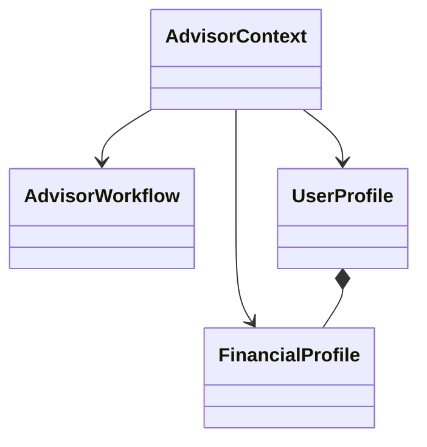
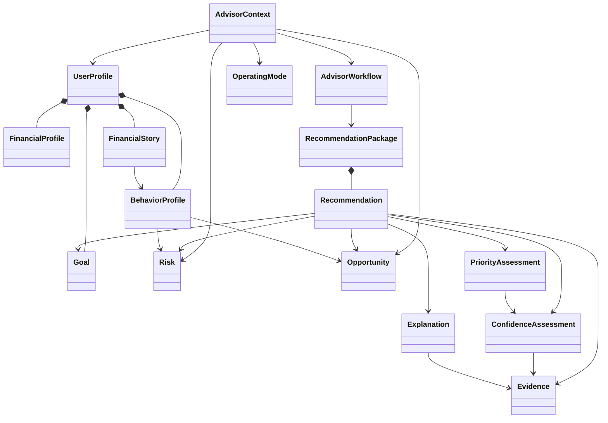

# Domain Model

## Purpose

The Domain Model defines the core business objects that represent the Financial Friday Advisor's understanding of a user's financial world.

Unlike the Recommendation Pipeline, which defines how reasoning occurs, or the Workflow State Model, which defines how processing is managed, the Domain Model defines **what exists** within the Advisor.

Every recommendation, workflow, engine, and persistence layer ultimately operates on the objects defined in this document.

The Domain Model serves as the single source of truth for the Advisor's business language.

---

# Guiding Principle

Every domain object should represent a meaningful concept within the user's financial life rather than a technical implementation detail.

Objects should model real-world financial concepts first and software structures second.

The Domain Model should remain stable even if implementation technologies change.

---

# Design Philosophy

The Advisor is built using Domain-Driven Design (DDD) principles.

Business concepts should drive the architecture.

The model should describe:

- financial knowledge
- user intent
- behavioral understanding
- recommendation reasoning
- workflow state

rather than storage formats or programming language constructs.

Every object should answer one question:

> "What financial concept does this represent?"

If no meaningful business concept exists, the object likely does not belong in the Domain Model.

---

# Domain Layers

The Advisor Domain is organized into several conceptual layers.

```text
User Domain
        │
        ▼
Financial Domain
        │
        ▼
Behavior Domain
        │
        ▼
Planning Domain
        │
        ▼
Recommendation Domain
        │
        ▼
Workflow Domain
```

Each layer builds upon the layers beneath it while remaining conceptually independent.

---

# Aggregate Roots

The Domain Model is centered around a small number of Aggregate Roots.

Aggregate Roots define ownership boundaries for related objects.

The primary Aggregate Roots are:

- AdvisorContext
- AdvisorWorkflow
- UserProfile
- RecommendationPackage

All remaining domain objects belong to or are referenced by one of these aggregates.

---

# Core Domain Objects

The foundational objects of the Advisor are:

| Object                | Purpose                                   |
| --------------------- | ----------------------------------------- |
| AdvisorContext        | Complete reasoning context for a request  |
| AdvisorWorkflow       | Represents processing of a request        |
| UserProfile           | Persistent user identity and preferences  |
| FinancialProfile      | Snapshot of the user's financial position |
| RecommendationPackage | Final recommendation result               |

These objects provide the foundation upon which all specialized objects are built.

---

# Advisor Context

## Purpose

AdvisorContext represents the complete information available to the Advisor while evaluating a request.

It is the primary input consumed by the Advisor Engine.

Every Recommendation Pipeline execution operates on exactly one AdvisorContext.

---

## Responsibilities

AdvisorContext is responsible for assembling:

- user information
- financial information
- behavioral information
- goals
- financial story
- workflow metadata
- operating mode
- retrieved memories
- request metadata

into a single reasoning model.

---

## Design Principles

AdvisorContext should always represent the Advisor's best current understanding of the user's financial situation.

It should never contain partial assumptions that cannot be identified.

Unknown information should remain explicitly unknown.

---

## Contains

AdvisorContext may contain references to:

- UserProfile
- FinancialProfile
- BehaviorProfile
- FinancialStory
- Goals
- Opportunities
- Risks
- OperatingMode
- AdvisorWorkflow
- Retrieved Memories
- Request Metadata

Additional domain objects may be added over time without changing the purpose of AdvisorContext.

---

## Lifecycle

AdvisorContext is created near the beginning of the Recommendation Pipeline.

It evolves as additional information becomes available.

When clarification is received, the existing AdvisorContext is updated rather than recreated whenever practical.

AdvisorContext exists only for the duration of a workflow unless explicitly preserved for auditing.

---

## Ownership

AdvisorContext owns:

- current request information
- retrieved domain references
- temporary reasoning state

It does not own persistent user information.

Persistent information belongs to UserProfile.

---

## Relationships

AdvisorContext references:

- one UserProfile
- one FinancialProfile
- one AdvisorWorkflow
- one OperatingMode
- zero or more Goals
- zero or more Risks
- zero or more Opportunities
- zero or more Memories

---

# Advisor Workflow

## Purpose

AdvisorWorkflow represents the lifecycle of a single reasoning session.

The workflow coordinates processing but does not perform reasoning itself.

Its detailed behavior is specified in the Workflow State Model.

Within the Domain Model, it exists as a first-class business object because financial conversations frequently span multiple interactions.

---

## Responsibilities

AdvisorWorkflow is responsible for:

- workflow identity
- workflow status
- pipeline progression
- clarification tracking
- resume information
- workflow timing
- workflow outcomes

---

## Design Principles

A workflow represents conversation continuity.

It should never contain financial reasoning directly.

Instead, it records where reasoning occurred and what information was produced.

---

## Relationships

AdvisorWorkflow references:

- one AdvisorContext
- zero or more Clarifications
- zero or more Workflow Events
- one RecommendationPackage

---

# User Profile

## Purpose

UserProfile represents the persistent identity of the Financial Friday user.

It contains relatively stable information that remains true across many Advisor Workflows.

Unlike AdvisorContext, which changes with every request, UserProfile evolves gradually over time.

---

## Responsibilities

UserProfile owns:

- user identity
- preferences
- personalization settings
- household relationships
- financial preferences
- communication preferences
- long-term configuration

---

## Examples

Examples include:

- preferred currency
- preferred explanation depth
- notification preferences
- risk tolerance
- household composition
- retirement target
- investing preferences

These values may influence recommendations but generally do not change during a single workflow.

---

## Design Principles

UserProfile should contain information about the person rather than the current financial situation.

Temporary financial conditions belong elsewhere.

---

## Relationships

UserProfile owns:

- FinancialProfile
- BehaviorProfile
- Goals
- FinancialStory

It may also reference:

- historical RecommendationPackages
- workflow history
- remembered preferences

---

# Financial Profile

## Purpose

FinancialProfile represents the Advisor's current understanding of the user's financial position.

It describes financial facts rather than recommendations or interpretations.

---

## Responsibilities

FinancialProfile owns financial state including:

- income
- expenses
- assets
- liabilities
- investments
- cash flow
- insurance
- tax information
- recurring obligations

The profile serves as factual input to financial reasoning.

---

## Design Principles

FinancialProfile should contain facts whenever possible.

Derived insights belong elsewhere.

For example:

Correct:

- Checking account balance
- Monthly income
- Mortgage balance

Not appropriate:

- Spending too much
- Poor emergency fund
- High investment risk

Those are conclusions generated by specialized engines.

---

## Data Freshness

Every FinancialProfile should include information describing the freshness of its contents.

Financial recommendations depend heavily on current information.

The Advisor should distinguish between:

- verified information
- estimated information
- historical information
- outdated information
- unavailable information

Confidence calculations depend heavily upon this distinction.

---

## Relationships

FinancialProfile may reference:

- Accounts
- Assets
- Liabilities
- Income Sources
- Expenses
- Investments
- Insurance Policies
- Tax Information

These supporting objects will be defined in the Core Data Objects specification.

---

# Relationship Summary

The foundational objects relate as follows.



AdvisorContext serves as the active reasoning model.

UserProfile represents persistent identity.

FinancialProfile represents persistent financial facts.

AdvisorWorkflow represents processing state.

Together, these four objects establish the foundation for every higher-level concept within the Advisor.

---

# Design Decisions

## AdvisorContext as the Primary Aggregate

Every recommendation begins with an AdvisorContext.

No engine should reason directly from raw user data.

---

## Persistent vs. Temporary State

Stable user information belongs to UserProfile.

Workflow-specific information belongs to AdvisorContext.

Processing state belongs to AdvisorWorkflow.

This separation reduces coupling and improves maintainability.

---

## Facts Before Interpretation

FinancialProfile stores observable financial facts.

Interpretations, risks, opportunities, and recommendations are produced by specialized engines rather than embedded within the profile.

---

## Aggregate Ownership

Each Aggregate Root owns its internal consistency.

Cross-aggregate references should remain lightweight whenever practical.

---

# Transition to Intelligence Objects

The foundational objects define **who the user is**, **what financial information exists**, and **how requests are processed**.

The next section defines the Advisor's higher-order understanding of the user, including:

- Goals
- Financial Story
- Behavior Profile
- Operating Mode
- Risks
- Opportunities

These objects transform raw financial information into actionable financial intelligence.

````

---

# Intelligence Objects

The Intelligence Objects represent the Advisor's understanding of the user's financial life.

Where the foundational objects describe **facts**, the Intelligence Objects describe **meaning**.

These objects transform financial data into financial understanding and ultimately drive recommendations.

Unlike FinancialProfile, which answers:

> "What is true?"

the Intelligence Objects answer questions such as:

- What is the user trying to accomplish?
- Why are they making these decisions?
- What behaviors influence their finances?
- What risks exist?
- What opportunities exist?
- How should the Advisor think right now?

These objects are produced, maintained, or interpreted by the Advisor's specialized intelligence engines.

---

# Goal

## Purpose

A Goal represents a desired future financial outcome that the user wants to achieve.

Goals provide direction for recommendations and allow the Advisor to evaluate decisions in terms of long-term success rather than immediate optimization.

Recommendations should always be evaluated against active goals whenever applicable.

---

## Responsibilities

A Goal defines:

- desired outcome
- priority
- target value
- target date
- current progress
- dependencies
- success criteria

Goals describe intent rather than implementation.

---

## Examples

Examples include:

- Build a six-month emergency fund
- Eliminate credit card debt
- Purchase a home
- Maximize employer retirement matching
- Save for college
- Reduce monthly spending
- Improve credit score
- Retire by age sixty

---

## Goal States

Goals may exist in multiple states throughout their lifecycle.

Examples include:

- Draft
- Active
- In Progress
- Deferred
- Completed
- Abandoned
- Archived

The implementation may choose the exact representation while preserving these business concepts.

---

## Goal Characteristics

Every Goal should define:

- importance
- urgency
- measurability
- timeframe

Some goals are strategic.

Others are tactical.

Both are valid.

---

## Relationships

A Goal belongs to one UserProfile.

A Goal may reference:

- Risks
- Opportunities
- Recommendations
- Financial Story Events

Multiple recommendations may support the same Goal.

Likewise, a single recommendation may support multiple Goals.

---

# Financial Story

## Purpose

FinancialStory represents the narrative context surrounding the user's financial life.

Numbers alone rarely explain financial decisions.

FinancialStory captures the events, transitions, motivations, and circumstances that influence financial behavior.

It provides the Advisor with context that cannot be inferred from account balances alone.

---

## Responsibilities

FinancialStory records meaningful financial events.

Examples include:

- Career changes
- Marriage
- Divorce
- Birth of a child
- Home purchase
- Military service
- Business ownership
- Medical hardship
- Inheritance
- Major relocation
- Retirement

These events influence recommendations long after they occur.

---

## Design Principles

FinancialStory should explain *why* the user's financial situation exists.

It should avoid duplicating information already represented elsewhere.

---

## Story Events

Each Story Event should represent a meaningful change in the user's financial journey.

Events should be:

- chronological
- verifiable whenever possible
- persistent
- meaningful

Minor conversational details should not become Story Events.

---

## Relationships

FinancialStory belongs to one UserProfile.

It may reference:

- Goals
- Recommendations
- Risks
- Opportunities
- Memories

The Story Engine uses FinancialStory to personalize recommendations.

---

# Behavior Profile

## Purpose

BehaviorProfile represents recurring financial behaviors observed over time.

Unlike FinancialProfile, which records financial facts, BehaviorProfile captures financial habits.

These habits allow the Advisor to make recommendations that are realistic rather than merely mathematically optimal.

---

## Responsibilities

BehaviorProfile identifies recurring patterns such as:

- spending behavior
- saving behavior
- investing behavior
- budgeting consistency
- debt management
- planning habits
- financial discipline
- decision-making tendencies

---

## Design Principles

BehaviorProfile should describe observed behavior rather than assign judgment.

For example:

Appropriate:

- Frequently pays credit cards early
- Maintains emergency savings
- Income varies seasonally

Not appropriate:

- Bad with money
- Financially irresponsible

Descriptions should remain objective.

---

## Confidence

Behavioral conclusions should include confidence.

Patterns observed repeatedly should receive greater confidence than isolated events.

Behavior should evolve as new evidence becomes available.

---

## Relationships

BehaviorProfile belongs to one UserProfile.

It influences:

- Recommendation generation
- Recommendation prioritization
- Explanation generation

BehaviorProfile may reference:

- FinancialStory
- Recommendation history
- Workflow outcomes

---

# Operating Mode

## Purpose

OperatingMode represents the Advisor's current reasoning strategy.

The same financial facts may require different recommendations depending upon the user's immediate circumstances.

OperatingMode allows the Advisor to adapt its reasoning appropriately.

---

## Responsibilities

OperatingMode determines:

- reasoning emphasis
- recommendation strategy
- explanation style
- prioritization strategy
- acceptable tradeoffs

It does not change financial facts.

It changes how those facts are interpreted.

---

## Example Modes

Possible Operating Modes include:

- Normal
- Planning
- Emergency
- Opportunity
- Coaching
- Review

Additional modes may be introduced without altering the overall architecture.

---

## Selection

OperatingMode is determined dynamically by the Operating Mode Engine.

Only one primary OperatingMode should exist during a workflow.

Secondary modes may supplement the primary mode when appropriate.

---

## Relationships

OperatingMode belongs to AdvisorContext.

It influences:

- Recommendation generation
- Priority assessment
- Confidence interpretation
- Response construction

---

# Risk

## Purpose

A Risk represents a condition that may negatively affect the user's financial well-being.

Risks are observations produced by the Advisor rather than financial facts.

---

## Responsibilities

Risks identify:

- probability
- potential impact
- affected goals
- severity
- urgency
- recommended mitigation

---

## Examples

Examples include:

- Low emergency savings
- High-interest debt
- Insufficient retirement contributions
- Concentrated investment allocation
- Cash-flow instability
- Insurance gaps

---

## Design Principles

Risks should always be evidence-based.

The Advisor should avoid speculative risks without sufficient supporting evidence.

---

## Relationships

A Risk may reference:

- FinancialProfile
- Goals
- FinancialStory
- Recommendations
- Evidence

Multiple recommendations may mitigate the same Risk.

---

# Opportunity

## Purpose

An Opportunity represents a situation where the user may improve their financial position.

Unlike Risks, Opportunities describe potential upside.

The Advisor should actively identify Opportunities rather than waiting for users to ask.

---

## Responsibilities

Opportunities identify:

- expected benefit
- required action
- timing
- effort
- dependencies
- affected goals

---

## Examples

Examples include:

- Employer retirement match
- Debt refinancing
- High-yield savings
- Tax optimization
- Cashback optimization
- Investment rebalancing
- Insurance savings
- Promotional interest rates

---

## Design Principles

An Opportunity should represent a realistic and actionable improvement.

Hypothetical possibilities without sufficient supporting evidence should not become Opportunities.

---

## Relationships

An Opportunity may reference:

- Goals
- FinancialProfile
- Recommendations
- Evidence
- OperatingMode

Multiple recommendations may arise from a single Opportunity.

---

# Intelligence Object Relationships

The Intelligence Objects extend the foundational domain by transforming financial facts into financial understanding.

```mermaid
classDiagram

class UserProfile
class Goal
class FinancialStory
class BehaviorProfile
class OperatingMode
class Risk
class Opportunity
class AdvisorContext

UserProfile *-- Goal
UserProfile *-- FinancialStory
UserProfile *-- BehaviorProfile

AdvisorContext --> OperatingMode
AdvisorContext --> Risk
AdvisorContext --> Opportunity

Goal --> Risk
Goal --> Opportunity

FinancialStory --> BehaviorProfile
BehaviorProfile --> Risk
BehaviorProfile --> Opportunity
````

These relationships intentionally avoid implementation-specific details while defining the conceptual ownership of financial intelligence.

---

# Design Decisions

## Intelligence is Derived

Financial intelligence objects are derived from financial facts rather than entered directly whenever practical.

---

## Narrative Matters

Financial decisions should consider the user's FinancialStory rather than relying exclusively on numerical optimization.

---

## Behavior Evolves

BehaviorProfile should adapt as the Advisor learns more about the user.

Behavior is not static.

---

## Opportunities are First-Class Objects

The Advisor should proactively identify opportunities, not merely react to problems.

---

## Risks Require Evidence

Every identified Risk should be supported by observable financial evidence.

---

# Transition to Recommendation Objects

The Intelligence Objects explain **what the Advisor understands** about the user.

The next section defines **what the Advisor produces** from that understanding, including:

- Recommendation
- Evidence
- Confidence Assessment
- Priority Assessment
- Explanation
- Recommendation Package

These objects represent the tangible outputs of the Advisor's reasoning process.

---

# Recommendation Objects

The Recommendation Objects represent the outputs produced by the Advisor's reasoning process.

Where the Intelligence Objects describe what the Advisor understands about the user's financial situation, the Recommendation Objects describe what the Advisor intends to communicate and why.

These objects are the primary products of the Recommendation Engine and collectively form the Recommendation Package presented to the user.

---

# Recommendation

## Purpose

A Recommendation represents a specific financial action that the Advisor believes will improve the user's financial position or help achieve one or more financial goals.

A Recommendation is the fundamental unit of advice produced by the Advisor.

Recommendations should be:

- actionable
- understandable
- evidence-based
- transparent
- appropriately prioritized

---

## Responsibilities

A Recommendation defines:

- recommended action
- intended outcome
- expected benefit
- associated risks
- supporting evidence
- confidence assessment
- priority assessment
- required assumptions
- related goals

A Recommendation should communicate _what_ the user should do rather than _how_ the Advisor reached the conclusion.

---

## Characteristics

Every Recommendation should answer the following questions:

- What should the user do?
- Why should they do it?
- What benefit is expected?
- What assumptions exist?
- What evidence supports it?
- How confident is the Advisor?
- How urgent is it?
- What risks should the user understand?

---

## Recommendation Types

Recommendations may represent many categories of financial advice.

Examples include:

- Spending reduction
- Debt repayment
- Savings strategy
- Investment strategy
- Insurance review
- Tax optimization
- Budget adjustment
- Credit improvement
- Cash flow management
- Goal planning
- Financial education

New recommendation categories may be introduced without changing the overall architecture.

---

## Recommendation Lifecycle

A Recommendation may progress through several stages.

Examples include:

- Generated
- Evaluated
- Prioritized
- Presented
- Accepted
- Deferred
- Rejected
- Completed
- Archived

The implementation may represent these states differently while preserving the business concepts.

---

## Relationships

A Recommendation may reference:

- Goals
- Risks
- Opportunities
- Evidence
- ConfidenceAssessment
- PriorityAssessment
- Explanation

Multiple Recommendations may support the same Goal.

---

# Evidence

## Purpose

Evidence represents the information supporting or contradicting a Recommendation.

Evidence provides transparency and enables users to understand why a Recommendation exists.

Without Evidence, Recommendations become opinions.

---

## Responsibilities

Evidence identifies:

- supporting facts
- contradicting facts
- source quality
- relevance
- completeness
- reliability

Evidence should remain independent of Recommendation wording.

---

## Sources

Evidence may originate from:

- FinancialProfile
- Goals
- FinancialStory
- BehaviorProfile
- User input
- Historical workflows
- Connected financial accounts
- Advisor reasoning

The implementation should distinguish between verified and inferred evidence.

---

## Characteristics

Every Evidence object should describe:

- source
- confidence
- relevance
- freshness
- relationship to the Recommendation

Evidence should never assume correctness simply because it exists.

---

## Relationships

Evidence supports:

- Recommendations
- Risks
- Opportunities

Evidence may reference multiple domain objects simultaneously.

---

# Confidence Assessment

## Purpose

ConfidenceAssessment represents the Advisor's estimate of how reliable a Recommendation is.

Confidence measures the quality of the recommendation—not the likelihood that the user will follow it.

---

## Responsibilities

ConfidenceAssessment evaluates factors such as:

- evidence quality
- evidence consistency
- data completeness
- data freshness
- assumption count
- uncertainty
- model limitations

---

## Interpretation

Higher confidence indicates stronger support for the Recommendation.

Lower confidence indicates greater uncertainty.

Low confidence does not necessarily imply a poor recommendation.

Instead, it communicates that additional information may improve decision quality.

---

## Confidence Levels

Implementations may choose numerical scoring, categorical scoring, or both.

Example categories include:

- Very High
- High
- Moderate
- Low
- Very Low

The scoring system should remain implementation-independent within the Domain Model.

---

## Relationships

ConfidenceAssessment belongs to one Recommendation.

It references:

- Evidence
- AdvisorContext
- Assumptions

---

# Priority Assessment

## Purpose

PriorityAssessment determines the order in which Recommendations should be presented.

Priority answers:

> "Which Recommendation should the user address first?"

Priority is independent from confidence.

A Recommendation may be highly confident yet low priority.

Likewise, an urgent Recommendation may have moderate confidence.

---

## Responsibilities

PriorityAssessment evaluates:

- urgency
- impact
- reversibility
- effort
- dependencies
- operating mode
- goal alignment
- risk reduction

---

## Design Principles

Priority should reflect the user's financial situation rather than generic financial advice.

The same Recommendation may receive different priorities for different users.

---

## Relationships

PriorityAssessment belongs to one Recommendation.

It references:

- Goals
- Risks
- OperatingMode
- ConfidenceAssessment

---

# Explanation

## Purpose

Explanation represents the user-facing reasoning accompanying a Recommendation.

Recommendations should never appear without sufficient explanation.

Transparency increases trust.

---

## Responsibilities

Explanation communicates:

- reasoning
- supporting evidence
- assumptions
- important tradeoffs
- confidence interpretation
- limitations
- expected outcomes

---

## Design Principles

Explanations should adapt to the user's requested level of detail.

Some users prefer concise summaries.

Others prefer comprehensive financial analysis.

The same Recommendation may produce multiple Explanation variants.

---

## Characteristics

An Explanation should answer:

- Why?
- Why now?
- What assumptions exist?
- What tradeoffs exist?
- What happens if nothing changes?

---

## Relationships

Explanation belongs to one Recommendation.

It references:

- Evidence
- ConfidenceAssessment
- PriorityAssessment

---

# Recommendation Package

## Purpose

RecommendationPackage represents the complete output of an Advisor Workflow.

It is the object ultimately returned by the Recommendation Pipeline.

The RecommendationPackage contains everything necessary to explain, review, audit, and act upon the Advisor's conclusions.

---

## Responsibilities

RecommendationPackage aggregates:

- Recommendations
- Explanations
- Confidence assessments
- Priority assessments
- Supporting evidence
- Risks
- Opportunities
- Follow-up questions
- Assumptions
- Workflow metadata

---

## Design Principles

RecommendationPackage should represent a coherent financial conversation rather than a disconnected collection of recommendations.

Recommendations should reinforce one another whenever practical.

Conflicting recommendations should be explicitly identified.

---

## Characteristics

Every RecommendationPackage should communicate:

- the overall financial picture
- the most important actions
- why those actions matter
- expected outcomes
- important uncertainties
- recommended next steps

---

## Relationships

RecommendationPackage belongs to one AdvisorWorkflow.

It contains:

- one or more Recommendations
- zero or more Follow-up Questions
- zero or more Risks
- zero or more Opportunities

---

# Recommendation Object Relationships

The Recommendation Objects transform financial understanding into actionable advice.

```mermaid
classDiagram

class RecommendationPackage
class Recommendation
class Evidence
class ConfidenceAssessment
class PriorityAssessment
class Explanation

RecommendationPackage *-- Recommendation

Recommendation --> Evidence
Recommendation --> ConfidenceAssessment
Recommendation --> PriorityAssessment
Recommendation --> Explanation

ConfidenceAssessment --> Evidence
PriorityAssessment --> ConfidenceAssessment
Explanation --> Evidence
Explanation --> ConfidenceAssessment
Explanation --> PriorityAssessment
```

The RecommendationPackage serves as the aggregate root for all recommendation-related objects.

---

# Design Decisions

## Recommendations are Independent Objects

Recommendations should remain independent of presentation.

The same Recommendation may be presented differently depending on context, operating mode, or user preferences.

---

## Evidence is a First-Class Domain Object

Evidence should exist independently rather than being embedded directly within Recommendations.

This allows evidence to support multiple Recommendations simultaneously.

---

## Confidence and Priority are Separate Concepts

Confidence measures certainty.

Priority measures importance.

The two should never be conflated.

---

## Transparency is Built Into the Domain

Explanation is a core domain object rather than a presentation concern.

Every Recommendation should be explainable.

---

## Recommendation Packages Represent Conversations

Users should experience a RecommendationPackage as a coherent financial discussion rather than a list of isolated suggestions.

---

# Transition to Domain Relationships

The Recommendation Objects complete the core business entities of the Advisor.

The final section of the Domain Model defines:

- aggregate boundaries
- ownership rules
- object lifecycles
- invariants
- complete domain relationship diagrams
- architectural constraints
- design decisions

These principles establish the rules that govern every domain object and provide the foundation for the Core Data Objects specification.

---

# Domain Relationships & Architectural Constraints

This section defines the structural rules governing every object within the Financial Friday Domain Model.

The previous sections defined _what_ the objects are.

This section defines _how they relate_, _who owns them_, _how they evolve_, and _what invariants must always remain true_.

These rules establish the architectural foundation for every future implementation.

---

# Complete Domain Relationship Diagram

The complete Domain Model can be visualized as the following conceptual relationship graph.



This diagram intentionally illustrates conceptual ownership rather than implementation-specific relationships.

---

# Aggregate Boundaries

Aggregate boundaries define consistency boundaries within the domain.

Objects inside an aggregate should maintain strong consistency.

Objects outside an aggregate should communicate through references rather than direct ownership.

The Advisor contains four Aggregate Roots.

---

## AdvisorContext Aggregate

Responsible for temporary reasoning state.

Owns:

- Active request
- OperatingMode
- Retrieved references
- Temporary reasoning state

References:

- UserProfile
- FinancialProfile
- AdvisorWorkflow
- Goals
- Risks
- Opportunities

---

## AdvisorWorkflow Aggregate

Responsible for workflow execution.

Owns:

- Workflow status
- Pipeline progress
- Resume information
- Workflow events
- RecommendationPackage

References:

- AdvisorContext

---

## UserProfile Aggregate

Responsible for persistent user knowledge.

Owns:

- FinancialProfile
- BehaviorProfile
- FinancialStory
- Goals
- Preferences

References:

- Historical workflows
- Historical recommendation packages

---

## RecommendationPackage Aggregate

Responsible for Advisor output.

Owns:

- Recommendations
- Explanations
- Evidence references
- Confidence assessments
- Priority assessments

References:

- Goals
- Risks
- Opportunities

---

# Ownership Rules

Ownership determines responsibility for maintaining object consistency.

The following rules should always remain true.

## Rule 1

Every Recommendation belongs to exactly one RecommendationPackage.

---

## Rule 2

Every RecommendationPackage belongs to exactly one AdvisorWorkflow.

---

## Rule 3

Every AdvisorWorkflow belongs to exactly one AdvisorContext during execution.

---

## Rule 4

Every AdvisorContext references exactly one UserProfile.

---

## Rule 5

Every UserProfile owns exactly one active FinancialProfile.

Historical FinancialProfiles may exist separately.

---

## Rule 6

Goals belong to the UserProfile.

Recommendations reference Goals.

Recommendations never own Goals.

---

## Rule 7

Risks and Opportunities belong to Advisor reasoning.

They should never become permanent user data without explicit promotion.

---

## Rule 8

Evidence supports Recommendations.

Evidence does not own Recommendations.

---

# Object Lifecycles

Every major object progresses through a lifecycle.

Understanding these lifecycles simplifies implementation and debugging.

---

## AdvisorContext Lifecycle

```text
Created

↓

Assembled

↓

Validated

↓

Expanded

↓

Consumed

↓

Archived
```

---

## AdvisorWorkflow Lifecycle

```text
Created

↓

Running

↓

Paused

↓

Resumed

↓

Completed

↓

Archived
```

Additional paths:

- Failed
- Cancelled

---

## Goal Lifecycle

```text
Draft

↓

Active

↓

In Progress

↓

Completed

↓

Archived
```

Possible alternate paths:

- Deferred
- Abandoned

---

## Recommendation Lifecycle

```text
Generated

↓

Evaluated

↓

Prioritized

↓

Presented

↓

Accepted

↓

Completed
```

Alternate outcomes include:

- Deferred
- Rejected
- Expired

---

# Domain Invariants

Invariants are business rules that must always remain true.

Violating an invariant indicates an invalid domain state.

---

## AdvisorContext Invariants

An AdvisorContext must:

- reference one UserProfile
- reference one AdvisorWorkflow
- represent one active request
- contain one OperatingMode

---

## UserProfile Invariants

A UserProfile must:

- maintain one active FinancialProfile
- preserve user identity
- preserve long-term preferences

---

## Goal Invariants

A Goal must:

- have a desired outcome
- belong to one UserProfile
- maintain a valid lifecycle state

---

## Recommendation Invariants

A Recommendation must:

- belong to one RecommendationPackage
- include an Explanation
- include a ConfidenceAssessment
- include a PriorityAssessment

Recommendations should not exist independently.

---

## Evidence Invariants

Evidence must:

- identify its source
- identify its relevance
- support or contradict a Recommendation

---

## RecommendationPackage Invariants

Every RecommendationPackage must contain at least one Recommendation.

A RecommendationPackage without Recommendations is not valid.

---

# Identity

Every Aggregate Root should possess a stable identity.

Recommended Aggregate identities include:

- AdvisorContext ID
- AdvisorWorkflow ID
- UserProfile ID
- RecommendationPackage ID

Supporting objects may also possess identifiers when beneficial.

Examples include:

- Recommendation ID
- Goal ID
- Evidence ID
- Story Event ID

Identity should remain stable throughout the object's lifetime.

---

# Immutability

The Advisor favors immutable business objects whenever practical.

Examples:

Once created:

- Recommendation reasoning should not change.
- Supporting Evidence should not change.
- Confidence calculations should not change.

Instead, new versions should be generated.

Mutable objects include:

- AdvisorContext
- FinancialProfile
- BehaviorProfile
- Goals

These naturally evolve over time.

---

# Temporal Modeling

Financial reasoning depends heavily upon time.

Many objects represent changing information.

Examples include:

- account balances
- investment values
- goal progress
- income
- expenses

The Domain Model should distinguish between:

- current state
- historical state
- projected future state

Time should be treated as a first-class concern rather than an implementation detail.

---

# Cross-Aggregate References

Objects should reference other aggregates rather than embedding them.

Preferred:

```
Recommendation
    references Goal
```

Avoid:

```
Recommendation
    owns Goal
```

This minimizes coupling while preserving consistency.

---

# Architectural Constraints

The following constraints apply throughout the Advisor.

---

## Business Before Technology

The Domain Model must never depend upon:

- Flutter
- Dart
- Firebase
- databases
- APIs
- serialization

Technology implements the domain.

The domain does not implement technology.

---

## Engine Independence

Domain objects must not depend upon specific engines.

For example:

Recommendation should not depend upon RecommendationEngine.

Instead:

RecommendationEngine produces Recommendation.

---

## Persistence Independence

Objects should exist independently of storage.

The same object should be usable:

- in memory
- in a database
- across APIs
- during testing

without changing its meaning.

---

## Presentation Independence

The Domain Model should never describe:

- widgets
- screens
- buttons
- layouts

Presentation belongs elsewhere.

---

# Relationship to Other Documents

The Domain Model establishes the business language used throughout the Advisor Architecture.

Subsequent documents build directly upon these definitions.

```
Advisor Intelligence Specification
            │
            ▼
Advisor System Architecture
            │
            ▼
Recommendation Pipeline
            │
            ▼
Workflow State Model
            │
            ▼
Domain Model
            │
            ▼
Core Data Objects
            │
            ▼
Engine Interfaces
            │
            ▼
Sequence Diagrams
            │
            ▼
Implementation
```

---

# Design Decisions

## Domain-Driven Design

Financial Friday adopts Domain-Driven Design as the primary architectural philosophy.

Business concepts define software structure.

---

## Aggregate-Oriented Architecture

Aggregate Roots establish ownership, consistency, and lifecycle boundaries.

They simplify persistence and future scalability.

---

## Separation of Facts and Intelligence

The Advisor intentionally separates:

- Financial facts
- Financial understanding
- Financial recommendations

This separation enables explainable reasoning.

---

## Recommendations are Products of Reasoning

Recommendations are generated.

They are never stored as permanent user state.

Only recommendation history may be retained.

---

## Explainability by Design

Every Recommendation should be explainable through:

- Evidence
- Confidence
- Priority
- Explanation

Explainability is a core architectural requirement rather than an optional feature.

---

## Stable Business Language

The terminology defined in this document represents the official language of the Financial Friday Advisor.

Future architectural decisions should extend this language rather than replacing it.

---

# Open Questions

The following questions remain intentionally deferred.

- Should scenarios become first-class domain objects?
- Should simulations be represented independently from recommendations?
- Should households become aggregate roots?
- Should advisor personas become domain concepts?
- How should long-term forecasting integrate into the model?
- Should collaborative planning introduce shared goal ownership?

These questions do not affect the current implementation and may be addressed in future versions.

---

# Future Considerations

Future versions of the Domain Model may introduce:

- Household financial models
- Estate planning
- Tax planning
- Insurance optimization
- Retirement simulations
- Monte Carlo forecasting
- Financial scenarios
- What-if analysis
- AI-assisted planning sessions
- Collaborative financial planning
- Professional advisor integration

These capabilities should extend the existing domain rather than replacing it.

---

# Guiding Principle

The Domain Model is the foundation of the Financial Friday Advisor.

It defines the language, relationships, and rules that every engine, workflow, recommendation, and implementation component must follow.

A well-designed Domain Model allows the Advisor to grow in capability without sacrificing consistency, explainability, or maintainability.
