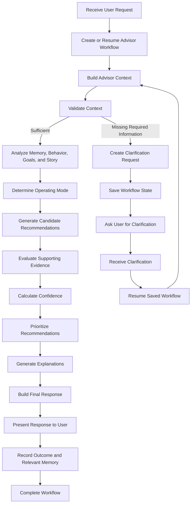

# Recommendation Pipeline Specification

## Purpose

The Recommendation Pipeline defines how a user request moves through the Financial Friday Advisor from initial input to final response.

The pipeline translates the Advisor Intelligence Specification and Advisor System Architecture into an implementation-ready workflow.

It is designed as a resumable process rather than a strictly linear sequence. This allows the Advisor to pause when required information is missing, request clarification, preserve completed work, and continue once the necessary information becomes available.

---

## Guiding Principle

The Advisor should never invent missing financial information or discard valid work simply because a request cannot be completed in one pass.

The pipeline should preserve state, explain what is missing, and resume from the appropriate stage when the user provides additional information.

---

## Workflow Model

The Recommendation Pipeline operates as a stateful, resumable workflow.

Each request creates or continues an Advisor Workflow. The workflow records:

- The original user request
- The current pipeline stage
- The assembled Advisor Context
- Completed stage outputs
- Missing information
- Clarification questions
- Workflow status
- Failure details
- Resume point
- Final recommendation package

A workflow may complete in a single pass or pause and resume across multiple user interactions.

---

## Workflow Statuses

An Advisor Workflow may have one of the following statuses:

- `created` — The workflow has been initialized.
- `running` — The workflow is actively processing.
- `awaiting_clarification` — Additional user information is required.
- `paused` — Processing has been intentionally suspended.
- `completed` — A final response has been produced.
- `failed` — The workflow cannot continue because of an unrecoverable error.
- `cancelled` — The workflow was ended by the user or system.

---

## High-Level Pipeline

---

## Pipeline Stages

### 1. Receive User Request

The pipeline receives the user's message and any available request metadata.

#### Inputs

- User request
- User identifier
- Session identifier
- Existing workflow identifier, when resuming

#### Outputs

- Normalized request
- Request metadata

---

### 2. Create or Resume Advisor Workflow

The system determines whether the request starts a new workflow or continues an existing one.

For a new workflow, the system creates a persistent workflow record.

For a resumed workflow, the system restores the previously saved state and verifies that the new user input corresponds to the pending clarification or continuation.

#### Responsibilities

- Create a unique workflow identifier
- Record the original request
- Restore prior workflow state when applicable
- Identify the current stage
- Prevent duplicate processing
- Record workflow status

#### Outputs

- Active Advisor Workflow

---

### 3. Build Advisor Context

The Context Builder assembles the financial, behavioral, historical, and conversational information required for reasoning.

#### Inputs

- Active Advisor Workflow
- User request
- User profile
- Financial data
- Relevant memory
- Goals
- Financial Story
- Recent interactions

#### Outputs

- Advisor Context
- Data freshness indicators
- Missing-information indicators
- Context conflicts

---

### 4. Validate Context

The pipeline determines whether the available context is sufficient to continue.

Information should be classified as:

- Required
- Helpful but optional
- Irrelevant to the current request

The absence of optional information should not unnecessarily block the workflow.

#### Possible Outcomes

- Continue processing
- Continue with reduced confidence
- Request clarification
- Stop because the request cannot be completed safely

---

### 5. Request Clarification

When required information is missing, the pipeline creates a focused clarification request.

The Advisor should ask only for information that is necessary to continue or materially improve the recommendation.

#### Responsibilities

- Identify the exact missing information
- Explain why the information is needed when useful
- Ask the smallest practical number of questions
- Avoid repeating previously answered questions
- Save the current resume point

#### Outputs

- Clarification request
- Pending information requirements
- Saved workflow state

---

### 6. Pause and Save Workflow State

Before returning a clarification question, the workflow saves all completed work.

#### Saved State

- Current pipeline stage
- Advisor Context
- Completed analysis
- Candidate outputs already produced
- Missing information
- Clarification request
- Resume point
- Workflow version

The workflow status becomes `awaiting_clarification`.

---

### 7. Resume Workflow

When the user provides clarification, the system restores the workflow and merges the new information into the existing context.

The pipeline should resume from the earliest stage affected by the new information rather than restarting all processing automatically.

#### Example

If the user provides a missing retirement age:

- Context validation should run again.
- Goal analysis may need to run again.
- Unrelated financial data retrieval may not need to repeat.

---

### 8. Analyze Advisor Context

The Advisor Engine coordinates specialized analysis of the assembled context.

#### Components

- Memory Engine
- Behavior Engine
- Goal Engine
- Story Engine

#### Outputs

- Relevant User Memory
- Behavioral Insights
- Goal Analysis
- Financial Story Context

Independent analyses may run concurrently when no dependency requires sequential execution.

---

### 9. Determine Operating Mode

The Operating Mode Engine determines the primary and optional secondary mode for the current workflow.

#### Possible Modes

- Normal
- Emergency
- Opportunity
- Planning
- Review
- Coaching

#### Outputs

- Primary operating mode
- Secondary operating mode, when applicable
- Mode rationale

---

### 10. Generate Candidate Recommendations

The Recommendation Engine produces possible actions based on the validated context and specialized analyses.

At this stage, recommendations are candidates only. They have not yet been selected, ranked, or approved for presentation.

#### Outputs

- Candidate recommendations
- Alternatives
- Preconditions
- Expected benefits
- Known tradeoffs
- Identified risks

---

### 11. Evaluate Supporting Evidence

The Evidence Engine evaluates the information supporting or contradicting each candidate recommendation.

#### Responsibilities

- Identify supporting evidence
- Evaluate source quality
- Evaluate relevance
- Detect conflicting evidence
- Detect outdated information
- Record evidence limitations

#### Outputs

- Evidence evaluation for each recommendation

---

### 12. Calculate Confidence

The Confidence Engine evaluates how reliable each candidate recommendation is.

#### Confidence Inputs

- Context completeness
- Data freshness
- Evidence quality
- Evidence consistency
- Assumption count
- Model uncertainty
- Recommendation specificity

#### Outputs

- Confidence score
- Confidence level
- Uncertainty explanation
- Missing-information impact

---

### 13. Prioritize Recommendations

The Priority Engine ranks the candidate recommendations.

#### Priority Inputs

- Expected impact
- Urgency
- User goals
- Operating mode
- Risk
- Effort
- Reversibility
- Confidence
- Dependencies
- User preferences

#### Outputs

- Prioritized recommendations
- Ranking rationale
- Deferred recommendations
- Rejected recommendations

---

### 14. Generate Explanations

The Transparency Engine creates explanations for the recommendations that will be presented.

#### Responsibilities

- Explain why the recommendation was made
- Identify important assumptions
- Communicate uncertainty
- Reference relevant evidence
- Explain major tradeoffs
- Adjust explanation depth to the user and request

#### Outputs

- Recommendation explanations
- Confidence disclosures
- Assumption disclosures

---

### 15. Build Final Response

The Response Builder assembles the final user-facing response.

#### Responsibilities

- Present recommendations in priority order
- Include relevant explanations
- Include important risks and tradeoffs
- Include clarification or follow-up questions when appropriate
- Match the requested level of detail
- Maintain consistent tone and formatting

#### Outputs

- Final user response
- Structured recommendation package

---

### 16. Present Response

The completed response is returned to the user.

The workflow should record the recommendations that were actually presented, because the final response may include only a subset of all generated candidates.

---

### 17. Record Outcome and Relevant Memory

After presentation, the system may record information needed for future continuity and evaluation.

#### May Record

- Recommendations presented
- User decisions
- User feedback
- Accepted or rejected recommendations
- Follow-up commitments
- New verified facts
- Goal changes
- Relevant Financial Story events

Information should only be stored when permitted by the applicable memory, privacy, and user-control rules.

---

### 18. Complete Workflow

The workflow status becomes `completed` after the final response and required records have been produced.

The completed workflow remains available for:

- Outcome tracking
- Recommendation evaluation
- Future context retrieval
- Auditability
- User review

---

## Resume Rules

A workflow should resume from the earliest stage whose output may have changed.

It should not automatically restart every stage.

### Examples

| New Information                            | Resume Point                            |
| ------------------------------------------ | --------------------------------------- |
| Missing account balance                    | Build Advisor Context                   |
| Corrected goal deadline                    | Goal analysis                           |
| Changed employment status                  | Build Advisor Context                   |
| User selects an alternative recommendation | Prioritization or response construction |
| User requests a simpler explanation        | Transparency Engine                     |
| User asks to see more options              | Recommendation Engine                   |
| User disputes an assumption                | Evidence or Confidence evaluation       |

---

## Idempotency

Pipeline stages should be designed to avoid unintended duplicate effects when repeated.

Re-running a stage should not:

- Duplicate memories
- Create duplicate recommendations
- Record the same outcome multiple times
- Repeat irreversible actions
- Corrupt workflow state

Side effects should occur through explicit, controlled operations.

---

## Failure and Recovery Behavior

Failures should be classified as recoverable or unrecoverable.

### Recoverable Failures

Examples include:

- Temporary data-source outage
- Missing optional account data
- Timeout from a supporting service
- Incomplete user input
- Stale cached information

The workflow should preserve state and retry, continue with limitations, or request clarification.

### Unrecoverable Failures

Examples include:

- Invalid workflow state
- Corrupted required data
- Authorization failure
- Unsupported request
- Failed safety or ethical validation

The workflow should stop safely, record the failure, and clearly explain what prevented completion.

---

## Clarification Handling

Clarification should be:

- Specific
- Minimal
- Relevant
- Easy to answer
- Connected to the active workflow

The Advisor should not ask broad questions when a narrow question is sufficient.

For example, prefer:

> What is the current balance on the credit card you want to pay off?

over:

> Tell me more about your finances.

---

## Output Contract

A completed Recommendation Pipeline should produce a Recommendation Package containing:

- Workflow identifier
- User request
- Advisor Context reference
- Active operating mode
- Prioritized recommendations
- Confidence evaluations
- Supporting evidence
- Explanations
- Risks and tradeoffs
- Assumptions
- Follow-up questions
- Memory updates proposed
- Outcome-tracking metadata

The exact object structure will be defined in the Core Data Objects document.

---

## Design Decisions

### Resumable Workflow

The Recommendation Pipeline is implemented as a resumable workflow rather than a one-way processing chain.

### Confidence Before Priority

Confidence is evaluated before prioritization so recommendation reliability can influence ranking.

### Explicit State Preservation

Completed work is saved before the pipeline pauses for clarification.

### Targeted Reprocessing

A resumed workflow repeats only the stages affected by new information.

### Controlled Side Effects

Memory updates and outcome recording occur through explicit operations rather than automatically throughout the pipeline.

---

## Open Questions

- How long should an incomplete workflow remain resumable?
- Can a user maintain multiple active workflows?
- How should conflicting clarification answers be handled?
- Which pipeline stages may execute concurrently?
- What workflow information should be visible to the user?
- When should temporary workflow state become long-term memory?

---

## Future Considerations

Future versions may support:

- Background workflows
- Scheduled financial reviews
- Multi-user household workflows
- Advisor-initiated recommendations
- Human-advisor review
- Workflow branching
- Parallel recommendation scenarios
- Long-running financial plans
- Cross-device workflow continuation
