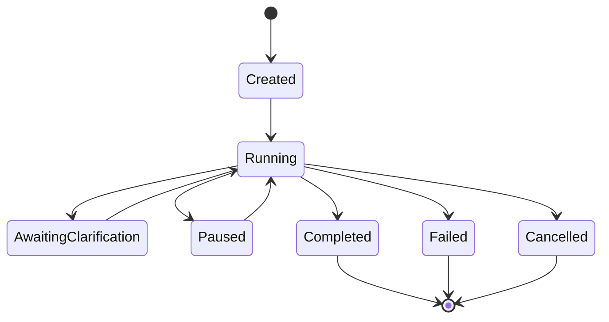

# Workflow State Model

## Purpose

The Workflow State Model defines how Financial Friday represents, tracks, pauses, resumes, and completes an Advisor Workflow.

Unlike the Recommendation Pipeline, which defines the sequence of processing stages, the Workflow State Model defines the persistent state that exists while a workflow is active.

Its purpose is to ensure that the Advisor can safely recover from interruptions, request clarification, preserve completed work, and continue reasoning without repeating unnecessary processing.

The Workflow State Model is independent of implementation details and serves as the architectural specification for workflow lifecycle management.

---

# Guiding Principle

An Advisor Workflow should always know:

- what it is doing,
- what it has already completed,
- what information is still missing,
- where it should resume,
- and why.

Workflow state should be explicit, recoverable, auditable, and deterministic.

---

# Workflow Lifecycle

Every Advisor request creates or resumes an Advisor Workflow.

A workflow progresses through well-defined lifecycle states until it is either completed, cancelled, or fails.



---

# Advisor Workflow

The Advisor Workflow represents a single logical reasoning session.

It contains all information required to process, pause, resume, audit, and evaluate a user request.

Every workflow has a unique identifier and remains immutable with respect to its identity throughout its lifetime.

---

## Workflow Responsibilities

The Advisor Workflow is responsible for:

- Tracking workflow progress
- Maintaining workflow status
- Recording completed pipeline stages
- Preserving Advisor Context
- Recording clarification requests
- Tracking resume points
- Recording workflow timing
- Recording workflow outcomes
- Supporting auditing
- Supporting recovery

---

# Workflow Status

Every workflow must always have exactly one status.

## Created

The workflow has been initialized but processing has not yet begun.

---

## Running

The workflow is actively executing the Recommendation Pipeline.

---

## Awaiting Clarification

Processing has paused because required user information is missing.

The workflow is resumable.

---

## Paused

Processing has been intentionally suspended.

Examples include:

- scheduled continuation
- temporary dependency outage
- manual pause
- maintenance

---

## Completed

The Recommendation Pipeline finished successfully and produced a final response.

---

## Failed

Processing encountered an unrecoverable error.

The workflow may be retained for diagnostics.

---

## Cancelled

Processing ended intentionally before completion.

Examples include:

- user cancellation
- duplicate workflow
- administrator cancellation

---

# Workflow Identity

Every workflow should contain:

- Workflow ID
- User ID
- Conversation ID
- Parent Workflow ID (optional)
- Creation timestamp
- Last updated timestamp
- Completion timestamp
- Current status
- Current pipeline stage

The Workflow ID should remain stable for the lifetime of the workflow.

---

# Pipeline State

The workflow records which stages have completed.

Example:

```text
Receive User Request            ✓

Build Advisor Context           ✓

Validate Context                ✓

Clarification Requested         ✓

Recommendation Generation       Pending

Confidence Evaluation           Pending

Response Builder                Pending
```

The implementation may represent this in any appropriate manner provided the current stage and completed stages are recoverable.

---

# Resume Point

Every paused workflow records a Resume Point.

The Resume Point identifies the earliest pipeline stage that must execute when processing resumes.

A Resume Point should include:

- Pipeline stage
- Reason for resuming
- Triggering information
- Timestamp

The Resume Point should always restart from the earliest stage whose outputs may have changed.

---

# Advisor Context Snapshot

Each workflow contains the Advisor Context that was available when processing paused.

The snapshot allows processing to resume without rebuilding unaffected portions of the workflow.

The snapshot may include:

- Financial profile
- Accounts
- Goals
- Financial Story
- Behavioral insights
- Operating mode
- Retrieved memories
- Recent recommendations
- Request metadata

The implementation may choose whether snapshots are stored by value or by reference.

---

# Pending Clarification

When clarification is required, the workflow records the pending request.

A clarification record should contain:

- Clarification ID
- Question presented
- Missing information
- Why the information is needed
- Required or optional classification
- Requested timestamp
- Response timestamp
- Response received
- Resolution status

Only unresolved clarification requests should block workflow completion.

---

# Workflow Metadata

Metadata records operational information about the workflow.

Examples include:

- Pipeline version
- Advisor version
- Model version
- Context version
- Retry count
- Processing duration
- Execution environment
- Correlation identifiers

Metadata should support debugging without influencing financial reasoning.

---

# Workflow Outputs

Throughout processing, the workflow accumulates outputs produced by each pipeline stage.

Examples include:

- Behavioral insights
- Goal analysis
- Story context
- Operating mode
- Candidate recommendations
- Evidence evaluations
- Confidence evaluations
- Prioritized recommendations
- Generated explanations
- Final response

Completed outputs should be reusable during workflow resumption whenever valid.

---

# Workflow Events

Every meaningful workflow action generates an event.

Examples include:

- Workflow created
- Stage completed
- Clarification requested
- Clarification received
- Workflow resumed
- Recommendation generated
- Recommendation accepted
- Recommendation rejected
- Workflow completed
- Workflow failed

Workflow Events provide a complete audit trail without requiring reconstruction from logs.

---

# State Preservation

Before any workflow pauses, the system should preserve:

- Current pipeline stage
- Completed stages
- Advisor Context
- Generated outputs
- Pending clarifications
- Resume point
- Workflow metadata

No completed work should be discarded unless it becomes invalid.

---

# Recovery Rules

When resuming:

- Restore workflow state
- Validate preserved context
- Merge new user information
- Determine earliest affected pipeline stage
- Continue processing

The workflow should avoid repeating unaffected stages whenever practical.

---

# Expiration

Incomplete workflows should not remain active indefinitely.

Implementations should support configurable expiration policies.

Possible expiration behaviors include:

- Automatic completion
- Automatic cancellation
- User notification
- Workflow archival

Expiration policies should balance usability, storage, and privacy considerations.

---

# Versioning

Workflow records should contain version information.

Examples include:

- Workflow schema version
- Recommendation Pipeline version
- Advisor Architecture version

Versioning supports future evolution while maintaining compatibility with previously stored workflows.

---

# Privacy

Workflow state may contain sensitive financial information.

Implementations should support:

- Encryption at rest
- Secure transmission
- Access controls
- Data minimization
- Configurable retention policies

Only information required to resume or audit a workflow should be retained.

---

# Auditability

Every workflow should provide sufficient information to answer questions such as:

- What recommendation was made?
- Why was it made?
- What information was available?
- What assumptions were made?
- What clarification was requested?
- What changed after clarification?
- Which pipeline stages executed?
- Which evidence supported the recommendation?

Auditability is essential for transparency, debugging, and continuous improvement.

---

# Relationship to Other Documents

The Workflow State Model complements the Recommendation Pipeline.

The Recommendation Pipeline defines **how** the Advisor processes requests.

The Workflow State Model defines **what is preserved** while processing occurs.

The Domain Model will define the specific business objects referenced throughout the workflow.

```
Advisor System Architecture
            │
            ▼
Recommendation Pipeline
            │
            ▼
Workflow State Model
            │
            ▼
Domain Model
```

---

# Design Decisions

## Stateful Workflows

Every Advisor interaction is represented as a persistent workflow rather than a temporary request.

---

## Explicit Resume Points

Workflow resumption begins from the earliest affected pipeline stage instead of restarting the entire pipeline.

---

## Immutable Workflow Identity

Workflow identifiers never change throughout the workflow lifecycle.

---

## Event-Based Audit Trail

Workflow history is recorded through explicit events rather than inferred from logs.

---

## Context Preservation

Previously completed analysis should be reused whenever valid.

---

# Open Questions

- How many active workflows should a user be allowed simultaneously?
- Should workflows support branching into multiple recommendation scenarios?
- Should workflows automatically expire after inactivity?
- Which workflow events should be exposed to users?
- Should users be allowed to manually resume or cancel workflows?

---

# Future Considerations

Future versions may support:

- Collaborative household workflows
- Multi-device continuation
- Background workflow execution
- Advisor-initiated workflows
- Scheduled financial reviews
- Human advisor handoff
- Workflow branching
- Scenario comparison
- Workflow analytics
- Cross-session reasoning continuity

---

# Guiding Principle

A workflow should preserve the Advisor's reasoning, not just its progress.

At any point during processing, the Advisor should be able to explain what it knows, what it is doing, why it paused, and exactly how it will continue.
